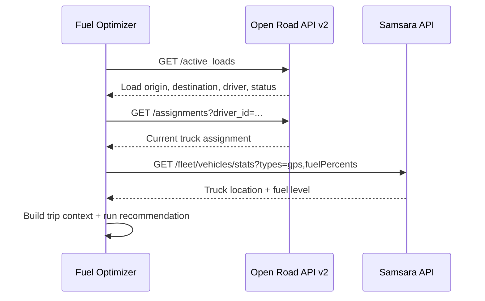

# Open Road TMS — API V2

Reference for the Open Road TMS REST API used by the Fuel Optimizer module (loads, fleet, assignments, fuel data).

**Spec:** OpenAPI (Swagger) 2.0  
**Base path:** `/api/v2`  
**OpenAPI JSON:** `/api-docs/v2/swagger.json` (relative to your Open Road TMS host)

> Replace `{OPENROAD_HOST}` with your tenant URL (e.g. the domain where you access Open Road TMS in the browser). Export `swagger.json` from your instance and save it under `Docs/` when available for full request/response schemas.

---

## Authentication

All endpoints require a valid API token.

| Header | Value |
|--------|--------|
| `Http-Access-Token` | `{token}` |

> **Note:** Open Road’s email may describe this as “Bearer” auth, but the V2 OpenAPI spec (`/api-docs/v2/swagger.json`) uses the `Http-Access-Token` header — **not** `Authorization: Bearer`. Using the wrong header returns `500` (not `403`).

Configure the token via the **Authorize** control in the Swagger UI, or pass the header on every request.

| HTTP status | Meaning |
|-------------|---------|
| `200` | Success |
| `403` | Invalid token provided |

Contact Open Road support (**help@openroadtms.com**) or your account rep to obtain API credentials.

---

## Base URL

```
https://{OPENROAD_HOST}/api/v2
```

**Swagger UI:** `https://{OPENROAD_HOST}/api-docs/v2`  
**OpenAPI spec:** `https://{OPENROAD_HOST}/api-docs/v2/swagger.json`

---

## Pagination

Most list endpoints accept a `page` query parameter (integer). Response shape is defined in `swagger.json` (typically paginated JSON).

---

## Endpoints

### Loads

#### `GET /active_loads`

Returns loads in **active delivering statuses** (en route, picked up, at shipper/consignee, etc.).

| Parameter | In | Type | Description |
|-----------|-----|------|-------------|
| `page` | query | integer | Page number |
| `driver_id` | query | integer | Filter by driver ID |
| `employee_nr` | query | string | Filter by driver employee number |

**Response:** `200` — Active loads returned  
**Content-Type:** `application/json`

**Fuel Optimizer use:** Primary source for active route context — origin, destination, and load status for trucks currently moving freight.

---

#### `GET /all_loads`

Returns **all loads** for the account, ordered by creation date (most recent first).

| Parameter | In | Type | Description |
|-----------|-----|------|-------------|
| `page` | query | integer | Page number |
| `driver_id` | query | integer | Filter by driver ID |
| `employee_nr` | query | string | Filter by driver employee number |

**Response:** `200` — All loads returned

**Fuel Optimizer use:** Historical / broader load queries; prefer `/active_loads` for live recommendations.

---

### Fleet — Drivers

#### `GET /drivers`

Returns drivers for the account.

| Parameter | In | Type | Description |
|-----------|-----|------|-------------|
| `page` | query | integer | Page number |

**Response:** `200` — Drivers returned

**Fuel Optimizer use:** Map drivers to trucks, loads, and Samsara driver identifiers.

---

### Fleet — Trucks & Trailers

#### `GET /trucks`

Returns trucks for the account.

| Parameter | In | Type | Description |
|-----------|-----|------|-------------|
| `page` | query | integer | Page number |
| `status` | query | string | Filter by status |

**`status` values:** `on_order`, `active`, `for_sale`, `disabled`, `marketing`, `on_hold`

**Response:** `200` — Trucks returned

**Fuel Optimizer use:** Truck registry; link Open Road unit numbers to Samsara vehicle names/IDs.

---

#### `GET /trailers`

Returns trailers for the account.

| Parameter | In | Type | Description |
|-----------|-----|------|-------------|
| `page` | query | integer | Page number |
| `status` | query | string | Filter by status |

**`status` values:** `on_order`, `active`, `for_sale`, `disabled`, `marketing`, `on_hold`

**Response:** `200` — Trailers returned

---

### Assignments

#### `GET /assignments`

Returns **current** driver-to-truck and driver-to-trailer assignments.

| Parameter | In | Type | Description |
|-----------|-----|------|-------------|
| `page` | query | integer | Page number |
| `driver_id` | query | integer | Filter by driver ID |
| `assignment_type` | query | string | `Truck` or `Trailer` |

**Response:** `200` — Assignments returned

**Fuel Optimizer use:** Resolve which truck is on an active load when only driver ID is known.

---

### Availability

#### `GET /availability_events`

Returns driver availability events (off-duty, loaded, planned, etc.).

| Parameter | In | Type | Description |
|-----------|-----|------|-------------|
| `page` | query | integer | Page number |
| `driver_id` | query | integer | Filter by driver ID |
| `status` | query | string | Filter by status |

**`status` values:** `off_duty`, `loaded`, `planned`, `pending_hometime`

**Response:** `200` — Availability events returned

---

### Fuel

#### `GET /fuel_cards`

Returns all fuel cards for the account with current driver assignments.

| Parameter | In | Type | Description |
|-----------|-----|------|-------------|
| `page` | query | integer | Page number |

**Response:** `200` — Fuel cards returned

---

#### `GET /fuel_card_transactions`

Returns fuel card transactions with optional date and driver filters. Ordered by most recent first.

| Parameter | In | Type | Description |
|-----------|-----|------|-------------|
| `page` | query | integer | Page number |
| `driver_id` | query | integer | Filter by driver ID |
| `date_from` | query | string (date) | From date (`YYYY-MM-DD`) |
| `date_to` | query | string (date) | To date (`YYYY-MM-DD`) |

**Response:** `200` — Fuel card transactions returned

**Fuel Optimizer use:** Historical fuel-ups and spend; may complement Relay pricing/transaction data.

---

### Safety

#### `GET /accidents`

Returns accident records for the account.

| Parameter | In | Type | Description |
|-----------|-----|------|-------------|
| `page` | query | integer | Page number |

**Response:** `200` — Accidents returned

**Fuel Optimizer use:** Out of scope for v1 recommendations; available for future reporting.

---

## Fuel Optimizer — recommended integration flow



| Step | Endpoint | Purpose |
|------|----------|---------|
| 1 | `GET /active_loads` | Active loads and route endpoints |
| 2 | `GET /assignments` | Driver → truck mapping |
| 3 | `GET /trucks` | Unit numbers for Samsara name matching |
| 4 | `GET /drivers` | Driver ID ↔ employee number |
| 5 | `GET /fuel_card_transactions` | Optional — validate past fuel stops |

---

## Example requests

```bash
# Active loads (paginated)
curl -s "https://{OPENROAD_HOST}/api/v2/active_loads?page=1" \
  -H "Http-Access-Token: {TOKEN}" \
  -H "Accept: application/json"

# Active loads for a specific driver
curl -s "https://{OPENROAD_HOST}/api/v2/active_loads?driver_id=123&page=1" \
  -H "Http-Access-Token: {TOKEN}"

# Current truck assignment for a driver
curl -s "https://{OPENROAD_HOST}/api/v2/assignments?driver_id=123&assignment_type=Truck" \
  -H "Http-Access-Token: {TOKEN}"

# Fuel transactions for a date range
curl -s "https://{OPENROAD_HOST}/api/v2/fuel_card_transactions?date_from=2026-01-01&date_to=2026-01-31&page=1" \
  -H "Http-Access-Token: {TOKEN}"
```

---

## Related documentation

| Resource | URL |
|----------|-----|
| Open Road help portal | https://help.openroadtms.com/ |
| Samsara ↔ Open Road integration | https://help.openroadtms.com/support/solutions/articles/151000057611-samsara |
| Open Road settings / integrations | https://help.openroadtms.com/support/solutions/articles/151000055889-step-1-configuring-openroad-tms-settings |
| Fuel Optimizer phases | [../FUEL_OPTIMIZER_PHASES.md](../FUEL_OPTIMIZER_PHASES.md) |
| Fuel Optimizer requirements | [../FUEL_OPTIMIZER_REQUIREMENTS.md](../FUEL_OPTIMIZER_REQUIREMENTS.md) |
| Samsara Fleet API | [SAMSARA_API.md](./SAMSARA_API.md) |
| Relay TMS Fuel API | [RELAY_TMS_FUEL_API.md](./RELAY_TMS_FUEL_API.md) |

---

## Open items

- [ ] Save `swagger.json` from `/api-docs/v2/swagger.json` into `Docs/` for full response schemas
- [x] Confirm `{OPENROAD_HOST}` for Paul's Assets — `app.openroadtms.com` (production)
- [x] Document which fields on load objects contain origin, destination, and route/polyline — **stops have lat/lng; no route polyline** (see [FUEL_OPTIMIZER_REQUIREMENTS.md](../FUEL_OPTIMIZER_REQUIREMENTS.md) §3.1)
- [ ] Confirm token provisioning and required scopes per endpoint
- [ ] Migrate to **External API v1** (`/api/ext/v1`, Basic Auth) — see OpenRoad `/llms-full.txt`

---

## External API v1 (new — July 2026)

Open Road is introducing a partner **External API** separate from the legacy V2 custom endpoints:

| | Legacy V2 (this doc) | External API v1 |
|--|----------------------|-----------------|
| Base | `/api/v2` | `/api/ext/v1` |
| Auth | `Http-Access-Token` | HTTP Basic (`client_id` + `client_secret`) |
| Loads | `/active_loads`, `/all_loads` | `GET /loads` with `status[]` filters |
| Response | Flat collections | `{ data, error, meta }` envelope |

**Fuel Optimizer implications:**

- Use `GET /loads/:id` destinations for stop `lat`/`lng` and stop order.
- TMS does **not** provide driving directions, polylines, or live truck GPS.
- Load `miles` / `empty_miles_sum` are billing fields (grantable), useful for distance scaling — not map geometry.
- Trip corridor for fuel planning = **Samsara truck position + TMS stop waypoints** (optional road routing via Google/OSRM).

Full v1 reference: `https://app.openroadtms.com/llms-full.txt`
