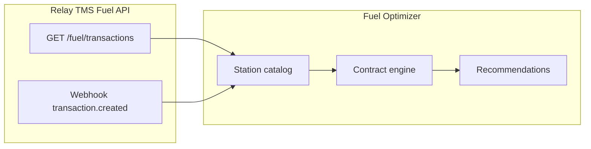

# Relay Payments — TMS Fuel API (v1.0)

REST API for TMS / carrier integration with Relay fuel: transactions, drivers, one-time fuel codes, fuel policies, and webhooks.

**OpenAPI spec:** [tmsfuel.yaml](./tmsfuel.yaml)  
**Version:** 1.0

---

## Environments

| Environment | Base URL |
|-------------|----------|
| Production | `https://app.relaypayments.com/api/integrations` |
| QA / Staging | `https://staging.relaypayments.com/api/integrations` |

All paths below are relative to the base URL.

---

## Authentication

**Scheme:** `ApiKeyAuth` — API key in the `Authorization` header.

```http
Authorization: {API_KEY}
```

> **Note:** Pass the raw API key (`iak_...`) — **no** `Bearer` prefix. In external systems this may be stored as `relayPaymentId`; for Fuel Optimizer it is only the Relay TMS Fuel API credential.

Obtain credentials from your Relay account representative or integration team.

### Configured keys (verified)

| Env variable | Production test |
|--------------|-----------------|
| `RELAY_API_KEY_BLUE_STALLION` | `GET /drivers/` → 200 |
| `RELAY_API_KEY_AZFS` | `GET /drivers/` → 200 |

Env names are labels for the two keys provided — not domain entities in this app. Billing/fee fields from other systems are unrelated.

Staging keys (`staging.relaypayments.com`) return `403` for these accounts — use **production** base URL.

### Environment variables

Configured in `backend/.env.local`:

```env
RELAY_API_BASE_URL=https://app.relaypayments.com/api/integrations
RELAY_API_KEY_BLUE_STALLION=iak_...
RELAY_API_KEY_AZFS=iak_...
```

---

## API groups

| Tag | Purpose |
|-----|---------|
| **Transactions** | Query fuel transactions (pricing, location, volume) |
| **Drivers** | Create and manage Relay driver records |
| **Fuel Codes** | Generate and manage one-time fuel/cash codes |
| **Driver Fuel Policies** | View policies and assign them to drivers |
| **Webhooks (BETA)** | Receive real-time transaction-created events |

---

## Transactions

### `GET /fuel/transactions/`

Request fuel transactions for a date range.

> **Important:** This endpoint uses a **different base URL** than drivers/policies/fuel codes.
> - Drivers, policies, codes: `https://app.relaypayments.com/api/integrations`
> - **Transactions:** `https://app.relaypayments.com/api` (no `/integrations`)

| Parameter | Required | Type | Description |
|-----------|----------|------|-------------|
| `dtstart` | yes | string (RFC3339) | Start date/time |
| `dtend` | yes | string (RFC3339) | End date/time |

**Response `200`:** Array of `Transaction` objects.

#### Transaction object (key fields)

| Field | Type | Description |
|-------|------|-------------|
| `transaction_id` | string | Relay external ID |
| `created_at` | string (RFC3339 UTC) | Transaction timestamp |
| `relay_fuel_code` | string | Relay fuel code used |
| `total_amount_paid` | string | Amount paid by carrier |
| `total_retail_price` | string | Total retail price |
| `total_amount_saved` | string | `total_retail_price - total_amount_paid` |
| `is_direct_bill` | boolean | `true` = billed by invoice; `false` = paid immediately |
| `currency_code` | string | Always `USD` for now |
| `cash_advance` | string | Cash advance amount, if any |
| `driver` | object | Driver on transaction |
| `merchant` | object | Fuel merchant (e.g. Pilot, Love's) |
| `location` | object | Station location + coordinates |
| `prompts` | array | Driver-entered prompts (e.g. Truck #) |
| `fuel_items` | array | Fuel line items with retail/discounted prices |
| `products` | array | Non-fuel products purchased |
| `fees` | array | Transaction fees |
| `fuel_policy` | object | Policy used (if applicable) |
| `fuel_code_type` | string | `policy` or `one_time` |

#### Location object (Fuel Optimizer relevant)

| Field | Description |
|-------|-------------|
| `id` | Relay location ID |
| `name` | Station name |
| `fuel_merchant_location_id` | Merchant's location ID |
| `address`, `city`, `state`, `zip_code` | Address |
| `latitude`, `longitude` | Geo coordinates |
| `opis_id` | OPIS station identifier (if available) |
| `timezone` | Location timezone |

#### Fuel item object

| Field | Description |
|-------|-------------|
| `fuel_type` | e.g. `diesel` |
| `fuel_type_description` | e.g. `Diesel #2` |
| `fuel_product_code` | Product code |
| `retail_price_per_unit` | Retail $/unit |
| `discounted_price_per_unit` | Contract/discounted $/unit |
| `volume` | Quantity purchased |
| `volume_uom` | e.g. `gallons` |
| `total_retail_price` | Line retail total |
| `total_discounted_price` | Line discounted total |
| `fees` | Line-level fees |

**Fuel Optimizer use:** Primary source for **historical** station pricing (`retail_price_per_unit`, `discounted_price_per_unit`), merchant, location, and OPIS ID at stations the fleet has fueled at.

```bash
curl -s "https://app.relaypayments.com/api/fuel/transactions/?dtstart=2026-01-01T00:00:00Z&dtend=2026-01-31T23:59:59Z" \
  -H "Authorization: {API_KEY}"
```

---

## Drivers

### `POST /drivers/`

Create a driver in Relay.

**Request body:**

| Field | Required | Description |
|-------|----------|-------------|
| `first_name` | yes | |
| `last_name` | yes | |
| `phone` | yes | |
| `email` | no | |
| `data_fields` | no | Array of `{ field_name, field_value }` — must match Relay-configured fields (e.g. `Truck #`) |

**Response `200`:** Driver object with `id`, `integration_id` (often used as TMS card number), timestamps.

### `GET /drivers/`

List all drivers.

| Parameter | Type | Description |
|-----------|------|-------------|
| `integration_id` | string | Filter by integration / card number |
| `offset` | integer | Records to skip |
| `limit` | integer | Page size (1–50, default 20) |
| `q` | string | Search phone, name, email |

### `GET /drivers/{id}`

Get one driver by Relay driver ID.

### `PUT /drivers/{id}`

Update driver (same body shape as create).

### `DELETE /drivers/{id}`

Delete driver. Returns `200` on success, `404` if not found.

---

## Fuel Codes

One-time codes bypass the driver's fuel policy and can only be used once (fuel or cash).

### `POST /fuelcodes/`

Create a one-time code.

| Field | Required | Description |
|-------|----------|-------------|
| `constraint_amount` | yes | Max purchase amount |
| `type` | yes | `fuel` or `cash` |
| `driver_id` | no | Relay driver ID |
| `note` | no | |
| `location_id` | no | Restrict code to one location |
| `allow_prohibited_location_redemption` | no | Allow out-of-network redemption |

**Response `200`:** Code object including `id`, `code` (the numeric code), timestamps.

### `GET /fuelcodes/`

List active/locked one-time codes.

| Parameter | Required | Description |
|-----------|----------|-------------|
| `dtstart` | yes | RFC3339 start |
| `dtend` | yes | RFC3339 end |
| `driver_id` | no | Filter by driver |
| `offset` | no | Pagination |
| `limit` | no | 1–50, default 20 |

### `GET /fuelcodes/{id}`

Get one code by ID.

### `PUT /fuelcodes/{id}`

Update code — **only allowed in `created` status**.

### `DELETE /fuelcodes/{id}`

Soft-delete code. Returns `200` or `404`.

---

## Driver Fuel Policies

Policies are **created/edited in the Relay portal only**. The API supports read + driver assignment.

### `GET /fuel/policies/`

List all fuel policies for the organization.

**Policy fields:** `id`, `name`, `eld_enabled`, `authorization_prompts`, `limits`

### `GET /fuel/policies/{id}`

Get one policy. Returns `404` if not found.

### `GET /fuel/policies/policy-assignments/{driver_id}`

Get a driver's current policy assignment including **usage and remaining** limits.

| Query | Description |
|-------|-------------|
| `driver_id` | Relay driver ID (e.g. `dr_FECwNMDrvXzHH8`) |

### `POST /fuel/policies/policy-assignments/`

Assign policy to driver. **Resets usage to 0.**

```json
{
  "driver_id": "dr_FECwNMDrvXzHH8",
  "policy_id": "pa_Eoz8wPAUopn6pF"
}
```

### `PUT /fuel/policies/policy-assignments/{id}`

Enable/disable assignment without resetting usage.

```json
{ "enabled": true }
```

Useful when driver is not on an active TMS trip.

| Query | Description |
|-------|-------------|
| `driver_id` | Relay driver ID |

### `DELETE /fuel/policies/policy-assignments/{id}`

Remove policy assignment from driver.

---

## Webhooks (BETA)

Configured by the **Relay integration team**. Provide staging and production callback URLs.

### Events

| Event | Description |
|-------|-------------|
| `transaction` / `created` | New fuel transaction |

### Delivery

- Sent immediately on event
- Up to **10 retries** with increasing delay
- **60 second** timeout — must return HTTP `200`
- **Idempotent handling required** — duplicate deliveries possible

### Signature validation

Header: `X-Relay-Signature`  
Format: `{timestamp}|{hmac_hex}`

1. Split header on `|` → timestamp + signature
2. Payload for HMAC = `{timestamp}` + raw POST body (e.g. `137458791{}`)
3. HMAC-SHA256 using your API key → hex string
4. Expected header = `{timestamp}|{your_hmac}`
5. Compare to received value

### Webhook payload schema

```json
{
  "id": "whe_chgKtNdPzLHkKQ",
  "category": "generic",
  "type": "transaction",
  "action": "created",
  "created_at": "2019-08-24T14:15:22Z",
  "entity": { }
}
```

`entity` has the same shape as a **Transaction** object from `GET /fuel/transactions/`.

---

## Fuel Optimizer — how this API fits

| Need | Relay endpoint | Notes |
|------|----------------|-------|
| Stations fleet has fueled at + prices | `GET /fuel/transactions/` | `location`, `fuel_items.discounted_price_per_unit`, `opis_id` |
| Merchant identity | Transaction `merchant` | Love's, Pilot, etc. |
| Driver ↔ truck linking | `driver`, `prompts`, `data_fields` | Truck # in prompts/fields |
| Real-time fuel events | Webhook `transaction.created` | Push vs poll |
| Driver sync with TMS | `POST/GET /drivers/` | `integration_id` maps to TMS card # |
| Policy control per trip | Policy assignments | Enable/disable when load active |

Relay covers **stations the customer has historically used** (~subset of all US stops). Broader corridor pricing may require OPIS or other sources (see requirements doc).



---

## Example: extract pricing from a transaction

```json
{
  "transaction_id": "txn_238c303jd303kd9",
  "merchant": { "name": "Pilot", "number": "92926262" },
  "location": {
    "name": "Pilot Travel Center #1212",
    "latitude": 32.281339,
    "longitude": -107.760101,
    "opis_id": "383473",
    "state": "MI"
  },
  "fuel_items": [
    {
      "fuel_type": "diesel",
      "retail_price_per_unit": "3.994",
      "discounted_price_per_unit": "3.669",
      "volume": "20.838",
      "volume_uom": "gallons"
    }
  ]
}
```

---

## Related documentation

| Resource | Link |
|----------|------|
| OpenAPI spec (source of truth) | [tmsfuel.yaml](./tmsfuel.yaml) |
| Relay Payments site | https://www.relaypayments.com/ |
| Partner integrations | https://www.relaypayments.com/partners-directory/ |
| Open Road TMS API | [OPEN_ROAD_TMS_API_V2.md](./OPEN_ROAD_TMS_API_V2.md) |
| Fuel Optimizer phases | [../FUEL_OPTIMIZER_PHASES.md](../FUEL_OPTIMIZER_PHASES.md) |

---

## Access checklist

- [x] Production API keys verified
- [ ] Webhook URLs registered (staging + prod) if using push
- [ ] Confirm whether price files beyond transactions API are available for your account
- [ ] Map Relay `integration_id` / driver IDs to Open Road TMS driver records
