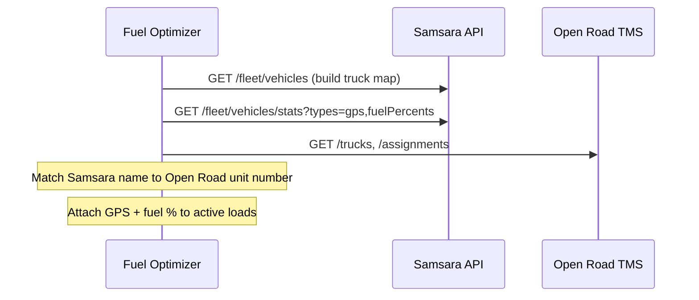

# Samsara — Fleet API (ELD)

Reference for the Samsara REST API used by the Fuel Optimizer (vehicle GPS location and fuel level for Paul's Assets pilot).

**Official docs:** https://developers.samsara.com/docs  
**API reference:** https://developers.samsara.com/reference  
**Base URL:** `https://api.samsara.com`

---

## Authentication

Samsara uses Bearer token authentication.

| Header | Value |
|--------|--------|
| `Authorization` | `Bearer {token}` |

API tokens are created in the Samsara dashboard (**Settings → API Tokens**). Required scopes for this project:

| Scope | Used for |
|-------|----------|
| Read Vehicles | Vehicle list / IDs |
| Read Vehicle Statistics | `GET /fleet/vehicles/stats` (GPS, fuel) |

---

## Environment variables

Configured in `backend/.env.local`:

```env
SAMSARA_API_BASE_URL=https://api.samsara.com
SAMSARA_API_TOKEN=samsara_api_...
```

---

## Key endpoints (Fuel Optimizer)

### Current snapshot — `GET /fleet/vehicles/stats`

Returns the **last known** telematics value per vehicle for the requested stat types.

| Parameter | Type | Description |
|-----------|------|-------------|
| `types` | string | Comma-separated stat types (see below) |
| `vehicleIds` | string | Optional — filter to specific vehicle IDs |
| `time` | string | Optional — RFC 3339 snapshot time (defaults to now) |
| `after` | string | Pagination cursor |

**Stat types for Fuel Optimizer:**

| Type | Description |
|------|-------------|
| `gps` | Last known latitude/longitude, speed, heading, reverse geocode |
| `fuelPercents` | Last known fuel tank level as **percentage** (0–100) |

> **Note:** `types=fuel` is **invalid** (returns `400`). Use `fuelPercents`.

**Example — GPS + fuel (combined):**

```bash
curl -G "https://api.samsara.com/fleet/vehicles/stats" \
  --header "Authorization: Bearer {TOKEN}" \
  --data-urlencode "types=gps,fuelPercents"
```

**Example — GPS only:**

```bash
curl -G "https://api.samsara.com/fleet/vehicles/stats" \
  --header "Authorization: Bearer {TOKEN}" \
  --data-urlencode "types=gps"
```

**Sample response shape:**

```json
{
  "data": [
    {
      "id": "281474977858657",
      "name": "167",
      "externalIds": { "samsara.vin": "3AKJHHDR4MSMX2112" },
      "gps": {
        "time": "2025-05-28T22:43:26Z",
        "latitude": 33.493420599,
        "longitude": -112.13622691,
        "headingDegrees": 0,
        "speedMilesPerHour": 0,
        "reverseGeo": {
          "formattedLocation": "3877 North 36th Avenue, Phoenix, AZ, 85019"
        }
      },
      "fuelPercent": {
        "time": "2025-05-28T18:39:28Z",
        "value": 14
      }
    }
  ],
  "pagination": {
    "endCursor": "",
    "hasNextPage": false
  }
}
```

**Fuel Optimizer fields:**

| Field | Use |
|-------|-----|
| `id` | Samsara vehicle ID |
| `name` | Truck unit number — map to Open Road TMS truck |
| `externalIds` | VIN and other external IDs |
| `gps.latitude` / `gps.longitude` | Current position on map / corridor search |
| `gps.time` | Staleness check |
| `fuelPercent.value` | Tank % for range / refill logic |

---

### Near real-time feed — `GET /fleet/vehicles/stats/feed`

Poll for **new** telematics events since the last request (cursor-based). Use for live dashboard updates (e.g. every 5–30 seconds).

| Parameter | Type | Description |
|-----------|------|-------------|
| `types` | string | e.g. `gps,fuelPercents` |
| `after` | string | Cursor from previous response |

Docs: https://developers.samsara.com/docs/vehicle-stats-feed

---

### Historical data — `GET /fleet/vehicles/stats/history`

Time-range telemetry for reporting or backfill (not for live recommendations).

| Parameter | Type | Description |
|-----------|------|-------------|
| `types` | string | Stat types |
| `vehicleIds` | string | Vehicle filter |
| `startTime` | string | RFC 3339 start |
| `endTime` | string | RFC 3339 end |

---

### Vehicle list — `GET /fleet/vehicles`

Registry of all vehicles (IDs, names, VINs). Use to build the Samsara ↔ Open Road truck mapping table.

```bash
curl "https://api.samsara.com/fleet/vehicles" \
  --header "Authorization: Bearer {TOKEN}"
```

---

## Integration flow (Fuel Optimizer)



1. **Bootstrap:** `GET /fleet/vehicles` — map `name` (unit #) to Samsara `id`.
2. **Snapshot:** `GET /fleet/vehicles/stats?types=gps,fuelPercents` — current position + fuel for all trucks.
3. **Live updates (optional):** Poll `GET /fleet/vehicles/stats/feed?types=gps,fuelPercents`.
4. **Join with TMS:** Match vehicle `name` to Open Road truck unit number from `/trucks` and `/assignments`.

---

## Verification status

| Check | Result |
|-------|--------|
| Token valid | Yes — `types=gps` and `types=fuelPercents` return `200` |
| Fleet data | Yes — vehicles returned with GPS and fuel % |
| `types=fuel` | Invalid — use `fuelPercents` |

---

## Related docs

| System | Doc |
|--------|-----|
| Open Road TMS API | [OPEN_ROAD_TMS_API_V2.md](./OPEN_ROAD_TMS_API_V2.md) |
| Relay TMS Fuel API | [RELAY_TMS_FUEL_API.md](./RELAY_TMS_FUEL_API.md) |
| Implementation phases | [FUEL_OPTIMIZER_PHASES.md](../FUEL_OPTIMIZER_PHASES.md) |

---

## Open items

- [ ] Confirm complete truck list mapping: Samsara `name` ↔ Open Road truck unit #
- [ ] Define staleness threshold for GPS/fuel readings (e.g. ignore if older than 30 min)
- [ ] Decide polling interval for feed vs snapshot for pilot UI
