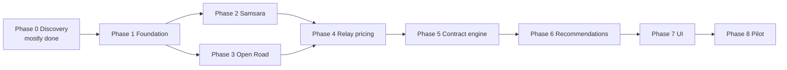

# Fuel Optimizer — Implementation Phases

Phased plan to build the Fuel Optimizer in this repo, based on **[FUEL_OPTIMIZER_REQUIREMENTS.md](./FUEL_OPTIMIZER_REQUIREMENTS.md)** (current), `Fuel_Optimizer_Requirements.docx` (original walkthrough), verified API access, and the current codebase shell.

## What we are building

A system that combines **truck position + fuel level** (Samsara ELD), **active trip context** (Open Road TMS stops + miles), **station prices** (Relay / OPIS), applies **per-customer contract rates**, and returns a **corridor-based fuel plan** — what to buy now (if needed) and where to fill strategically ahead on the trip — using only **contracted stations on the route path**.

**Pilot scope:** Paul's Assets fleet — Samsara + Open Road TMS, with Relay fuel pricing for contracted merchants.

**Build approach:** Greenfield optimizer modules on top of the existing auth/dashboard shell. No reuse of a prior Fuel Optimizer codebase. The existing `fuel-log` module stays as-is (manual entries) unless repurposed for reporting later.

---

## Current state

| Area | Status |
|------|--------|
| Auth (login + email OTP), users/roles | Done — reuse as platform shell |
| Dashboard shell + settings (email config) | Done — extend for optimizer |
| Basic `fuel-log` API | Placeholder — not optimizer logic |
| API credentials (dev/prod env) | Done — Open Road, Samsara, Relay |
| Integration API docs | Done — see [Docs/](#integration-reference) |
| Samsara ELD sync + fleet mapping | **In progress** |
| Open Road TMS sync + trip context | **In progress** |
| Relay station catalog + contract pricing | **In progress** |
| Recommendation engine v1 (single stop) | **In progress** |
| Corridor fuel plan v2 (now + ahead, gallon guidance) | **Not started** |
| TMS External API v1 migration | **Planned** |

---

## Integration reference

| System | Doc | Base URL | Auth |
|--------|-----|----------|------|
| Open Road TMS V2 | [OPEN_ROAD_TMS_API_V2.md](./Docs/OPEN_ROAD_TMS_API_V2.md) | `https://app.openroadtms.com/api/v2` | `Http-Access-Token: {token}` — **not** `Bearer` |
| Samsara | [SAMSARA_API.md](./Docs/SAMSARA_API.md) | `https://api.samsara.com` | `Authorization: Bearer {token}` |
| Relay TMS Fuel | [RELAY_TMS_FUEL_API.md](./Docs/RELAY_TMS_FUEL_API.md) | `https://app.relaypayments.com/api/integrations` | `Authorization: {iak_...}` — raw key, no `Bearer` |

**Verified (production):**

- Open Road — token works; `GET /drivers`, `/active_loads`, `/trucks`, etc.
- Samsara — token works; `GET /fleet/vehicles/stats?types=gps,fuelPercents`
- Relay — production API keys verified via `GET /drivers/` (two accounts configured in env for testing/access)

**Env vars** (see `backend/.env.local` / `.env.example`):

- `OPENROAD_API_BASE_URL`, `OPENROAD_API_TOKEN`
- `SAMSARA_API_BASE_URL`, `SAMSARA_API_TOKEN`, `SAMSARA_TELEMETRY_STALE_MINUTES`
- `TRIMBLE_API_BASE_URL`, `TRIMBLE_API_KEY`
- `RELAY_API_BASE_URL`, `RELAY_API_KEY_BLUE_STALLION`, `RELAY_API_KEY_AZFS` (API keys only — unrelated company/fee fields from other systems are out of scope)

**Known API quirks:**

- Open Road truck fuel % is **not** in `/trucks` — use Samsara `fuelPercents`.
- Samsara: use `fuelPercents`, not `types=fuel` (returns 400).
- Relay staging returns 403 for current keys — use production base URL.
- Open Road built custom V2 endpoints for loads, trucks, drivers, fuel cards/transactions per XXII account.

---

## Phase 0 — Discovery

**Goal:** Resolve unknowns before building core logic.

**Done:**

1. ~~Prior codebase reuse~~ — **decision: build from scratch.**
2. Open Road TMS API documented and token verified (`app.openroadtms.com`).
3. Samsara fields confirmed: `gps`, `fuelPercents`; vehicle `name` = unit number for truck mapping.
4. Relay API documented; production keys verified for two merchant accounts.
5. Integration docs written under `Docs/`.

**Remaining:**

1. **OPIS/Opus** — confirm product (rack vs retail), credentials, and whether needed for pilot or Relay-only is enough.
2. **Open Road External API v1 migration** — Basic Auth, `/api/ext/v1/loads`, envelope responses; confirm `fuel_card_transactions` availability.
3. **Relay transactions** — confirm date ranges with data; `GET /fuel/transactions/` returned 404 for Jan 2026 test window (may be empty or account-specific).

**Resolved (see [FUEL_OPTIMIZER_REQUIREMENTS.md](./FUEL_OPTIMIZER_REQUIREMENTS.md)):**

1. **Open Road load shape** — destinations include `lat`/`lng`; **no route polyline** in TMS External API.
2. **Recommendation strategy** — full-trip **corridor** (not radius); survival vs strategic fill; optional routing API for accuracy.
3. **v1 recommendation rules** — corridor buffer 15 mi, reserve 15%, contracted only, lowest effective price, 1 primary + 2 alternates.

**Exit criteria:** OPIS go/no-go for pilot; TMS v1 migration plan agreed; requirements doc signed off.

---

## Phase 1 — Foundation (data model + integration clients)

**Goal:** Core domain models and thin API clients — no UI yet.

1. **Customer / fleet model**
   - Pilot fleet: Paul's Assets.
   - Link users to customer/fleet (extend existing roles).

2. **Integration settings**
   - Store API credentials per customer (env for single-tenant pilot; DB when multi-tenant).
   - HTTP clients for each provider with correct auth headers.
   - **Relay:** only the TMS Fuel API (`relayPaymentId` / `iak_...` key) — transactions, drivers, fuel codes, policies. Fee/billing fields from other apps are not part of this project.

3. **Contract data model**
   - merchants (Love's, Pilot, etc.)
   - rate adjustment per merchant (e.g. −$0.06/gal)
   - station IDs / locations covered by each contract
   - effective dates

4. **Truck / driver mapping tables**
   - Samsara vehicle `name` ↔ Open Road truck unit number
   - Open Road driver `id` / `employee_nr` ↔ Relay driver (when needed)

Build backend modules following existing patterns (`modules/auth`, `modules/fuel-log`). Admin settings UI can follow the email-config pattern in a later phase.

**Exit criteria:** Backend can call all three APIs through shared clients; Paul's Assets + contract rules persist in DB.

---

## Phase 2 — ELD integration (Samsara)

**Goal:** Know where each truck is and how much fuel it has.

1. `GET /fleet/vehicles` — sync vehicle registry.
2. `GET /fleet/vehicles/stats?types=gps,fuelPercents` — snapshot all trucks.
3. Optional: `GET /fleet/vehicles/stats/feed` for near-real-time polling.
4. Store latest telemetry per truck with timestamp; flag stale readings.

Project44 is out of scope for the pilot.

**Exit criteria:** API returns live GPS + fuel % for Paul's Assets trucks, mapped to internal truck records.

---

## Phase 3 — TMS integration (Open Road)

**Goal:** Know where the truck is going, not just where it is.

1. `GET /active_loads` — loads in active delivering status (primary).
2. `GET /all_loads` — broader load history when needed.
3. `GET /trucks`, `/drivers`, `/assignments` — fleet context and truck↔driver links.
4. `GET /fuel_card_transactions` — historical fuel-ups for validation/reporting.
5. Build **trip context**: Samsara snapshot + active load (ordered stops with lat/lng, origin/destination labels).

Open Road confirmed: truck fuel % comes from Samsara. TMS provides **stop waypoints**, not road geometry — trip path is truck GPS + ordered TMS stops (see requirements §4.5.6).

**Exit criteria:** For a truck on an active load, the system has position, fuel %, origin, destination, ordered stops with coordinates, and a waypoint-based corridor polyline.

---

## Phase 4 — Station catalog + pricing (Relay)

**Goal:** Candidate stations and base prices.

1. **Relay drivers** — `GET /drivers/` per merchant account.
2. **Relay transactions** — `GET /fuel/transactions/` for historical pricing, locations, merchants, volumes.
3. **Station master** — normalize merchant + location + coordinates from transaction data.
4. **OPIS/Opus** (if Phase 0 confirms) — broader station universe + rack/retail; public Rack API docs exist but credentials TBD.

Relay-only is acceptable for the pilot if OPIS is delayed.

**Exit criteria:** Query stations with base/discounted prices for merchants Paul's Assets has contracts with.

---

## Phase 5 — Contract pricing engine

**Goal:** Customer-specific effective price at each station.

1. Apply merchant contract rules to base price from Relay (and OPIS if available).
2. Exclude stations with no contract (matches current Relay app behavior).
3. Unit tests with documented examples (Love's −$0.06, Pilot −$0.03, Speedway +$0.05).

Contract adjustments are configured in **this app** — not imported from external Relay company records.

**Exit criteria:** Given a station + customer, return effective price or "not available."

---

## Phase 6 — Recommendation engine

### Phase 6a — v1 (single stop) — **in progress**

**Goal:** Defensible single-stop recommendation along trip corridor.

1. Build corridor polyline: truck position → remaining TMS stops (waypoint mode; optional Google/OSRM road polyline).
2. Filter stations: **in corridor** (not radius-only), ahead on route, within remaining fuel range, contracted, priced.
3. Rank by effective price; tie-breakers (distance, corridor proximity).
4. Return one primary recommendation plus optional alternates.
5. Expose API endpoint (e.g. `GET /recommendations/:identifier`).

**Exit criteria:** Backend returns a defensible fuel stop for a real truck on a real load.

### Phase 6b — v2 (corridor fuel plan) — **not started**

**Goal:** Client-aligned multi-state fuel intelligence.

1. Scan **full remaining trip corridor** for contracted stations (not limited to current fuel range for price discovery).
2. Identify **strategic fill** station(s) — cheapest viable stop on corridor.
3. If fuel low now, compute **survival fill** — minimum gallons to reach strategic stop.
4. Return fuel **plan** (now + ahead) with gallon amounts, reasons, estimated savings.
5. Enforce max stops, sweet-spot rules, min-savings threshold.
6. Support **waypoint-only mode** (no Google/OSRM) with conservative distance estimates.

**Exit criteria:** Driver sees “add X gal now, fill at [station] in Y mi” for a multi-state haul; no off-route stations recommended.

---

## Phase 7 — Driver / dispatcher UI

**Goal:** Make recommendations usable in the app.

1. Fuel Optimizer section in dashboard (sidebar nav).
2. Settings: integrations overview, contract summary.
3. Operations view: truck list, active load, fuel %, recommended stop.
4. Map view (directional): truck, trip corridor, stops, recommended station(s), fuel plan summary, effective price.

Reuse existing dashboard theme and auth shell.

**Exit criteria:** Dispatcher or driver can see "stop at X for $Y/gal" without manual price comparison.

---

## Phase 8 — Pilot hardening (Paul's Assets)

**Goal:** Validate end-to-end in production-like conditions.

1. End-to-end test on a known long-haul route.
2. Compare recommendations against Relay app / manual planning.
3. Fix mapping issues (truck IDs, stale GPS/fuel, range math).
4. Logging and monitoring for integration failures (Open Road 500 on wrong auth header, stale Samsara pings, etc.).

**Out of scope:** additional customers, other ELD providers, final visual design.

**Exit criteria:** Paul's Assets pilot runs reliably on real trucks and loads.

---

## Phase order

Phases 2 and 3 can overlap after Phase 1. Phase 4 can start once Relay transaction data access is confirmed.

---

## Resolved vs open

| Topic | Status |
|-------|--------|
| Build from prior codebase | **Resolved** — from scratch |
| Open Road API access | **Resolved** — verified |
| Open Road auth header | **Resolved** — `Http-Access-Token` |
| Samsara GPS + fuel fields | **Resolved** — `gps`, `fuelPercents` |
| Relay API access | **Resolved** — production keys verified |
| Relay scope for this app | **Resolved** — TMS Fuel API only (transactions, drivers, codes, policies) |
| OPIS/Opus credentials + scope | **Open** |
| Open Road load route fields | **Resolved** — stop lat/lng only; no TMS polyline ([requirements](./FUEL_OPTIMIZER_REQUIREMENTS.md) §3.1) |
| Recommendation algorithm (v1) | **Resolved** — corridor, range, price rank ([requirements](./FUEL_OPTIMIZER_REQUIREMENTS.md) §4.5) |
| Recommendation algorithm (v2 fuel plan) | **Specified** — survival/strategic fill; implementation pending |
| Routing API required | **Resolved** — optional; waypoint corridor mode required |
| Relay transaction history availability | **Open** — test with real date ranges |
| Open Road External API v1 migration | **Open** — in progress |
| How contract/merchant data is maintained over time | **Open** |

---

## Out of scope (pilot)

- Additional ELD providers (e.g. Project44).
- Customers beyond Paul's Assets.
- Final UI/visual design (reference screenshots are directional only).
- Reuse of any prior Fuel Optimizer implementation.
